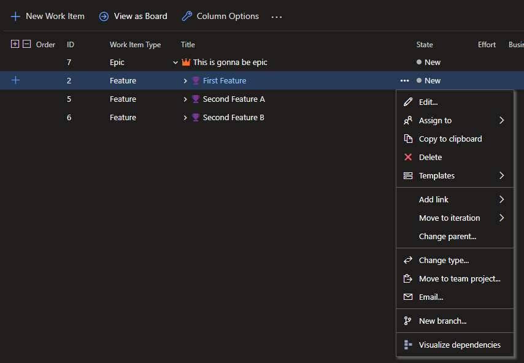
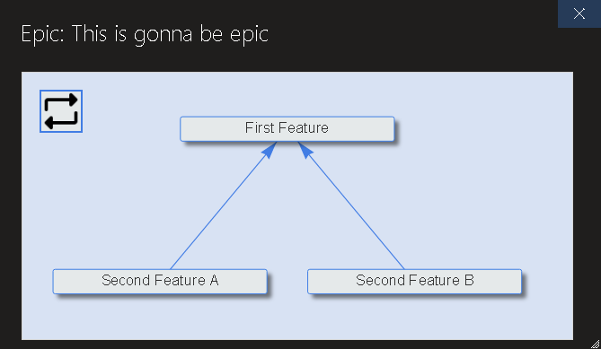
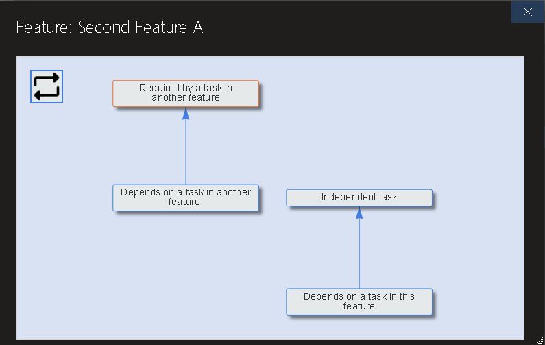

# Dependency Visualizer

This is an Azure DevOps extension for visualizing predecessor and successor links between work items.

## Installation

Install the extension from the [Visual Studio Marketplace](https://marketplace.visualstudio.com/items?itemName=JulianValdezNI.azure-devops-dependency-visualizer).

## Launch

The visualizer is launched through a command on a work item in the backlogs board. Executing the command on an item visualizes all dependencies internal to that item. For example, launching the command on a user story visualizes dependencies between the tasks under that story.

## The dependency graph

Predecessor/successor links are shown as directed edges on the graph. No other link types are represented.

Double-clicking a node opens the work item in a new tab or window. A refresh button in the upper left corner refreshes the graph (for instance, after changes to the underlying work items or links).

## Dependencies to external items

If a work item precedes or succeeds an item not parented under the current work item (the item from which the visualizer was launched), that external item is shown with a distinct border color.